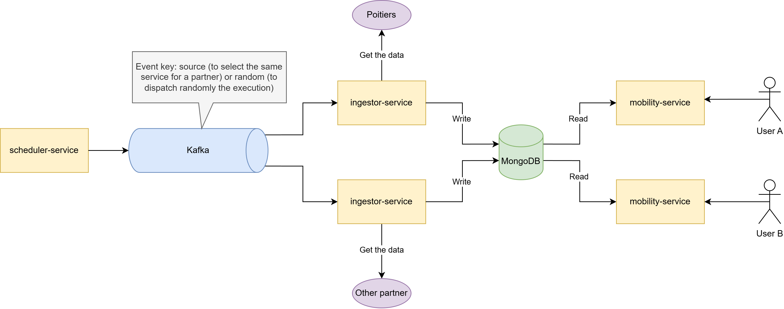

# IS-technical-test

## Répartition du temps de travail

| Date             | Durée (approximative) | Détails                                                           |
|------------------|-----------------------|-------------------------------------------------------------------|
| Vendredi 14 août | 3h00mins              | Réflexion, setup SpringBoot, modèles, intégration partenaire(s)   |
| Samedi 15 août   | 3h30mins              | Intégration partenaire(s), tests, controller, service, repository |
| Dimanche 16 août | 4h00mins              | Tests, peaufinages, README.md                                     |

Total (approximatif) : 10h30mins

## Démarrage

### Application

Pour exécuter le projet, il faudra :
- JDK 25 ;
- Un serveur MongoDB (via Docker par exemple).

Renseignez dans ``application-dev.properties`` votre URI MongoDB.

Lancez le projet avec la commande :

```bash
./mvnw spring-boot:run -Dspring-boot.run.profiles=dev
```

### Tests

Pour exécuter les tests, il faudra :
- JDK 25 ;
- Docker (pour utiliser Testcontainers).

Lancez les tests avec la commande :
```bash
./mvnw test
```

## Les choix faits

### Technologies

- SpringBoot (version 4.1.0) : choix évident car c'est le framework backend sur lequel je suis le plus à l'aise et qui
  est demandé par le poste.
- MongoDB (version 8.3.8, dans les tests) : base de données sur laquelle j'ai acquis le plus d'expérience ces dernières années.
  Je savais que MongoDB offre la possibilité de manipuler des données [GeoJSON](https://www.mongodb.com/docs/manual/reference/geojson/) et de calculer les distances
  ([$near](https://www.mongodb.com/docs/manual/reference/operator/query/near/)).
  Ce choix est donc justifié par la facilité d'implémentation et mon souhait de vouloir aller vite pour livrer le projet.

### Architecture

L'architecture du service est un monolithe, pour notamment livrer rapidement le projet.

2 parties sont à distinguer :

1. La partie ingestion de données provenant du partenaire externe et la sauvegarde de ces données dans un modèle
   standard.
2. La partie restitution des données aux utilisateurs.

#### Ingestion et sauvegarde

Chaque collecte d'informations provenant d'un partenaire a un cycle de vie indépendant.

Aujourd'hui, nous collectons les parkings de la ville de Poitiers. Cela implique un adaptateur, nommé ``PoitiersParkingsTask``.

Voici sa configuration associée :

```properties
# Feature flag pour activer la collecte des parkings pour le partenaire Poitiers.
app.scheduler.tasks.POITIERS_PARKING.enabled=true
# Cette collecte s'effectuera chaque minute.
app.scheduler.tasks.POITIERS_PARKING.cron=0 * * * * *
# URL pour collecter l'information.
app.scheduler.tasks.POITIERS_PARKING.url=https://data.grandpoitiers.fr/data-fair/api/v1/datasets/mobilites-stationnement-des-parkings-en-temps-reel/lines
```

Demain, ajouter un nouveau partenaire signifie un nouvel adaptateur (avec un nouveau ``DataSourceType`` en clé) et la configuration associée.

L'adaptateur consiste à collecter l'information depuis une source de données et de convertir celle-ci dans un modèle standard (l'entité ``Parking`` en base de données).

La collecte des informations s'effectue par un client HTTP (HttpExchange).

J'ai choisi d'utiliser le BulkWrite pour sauvegarder les informations en base de données pour éviter de séquentiellement
envoyer des requêtes de sauvegarde entre l'application Spring et MongoDB.
L'exécution est ``UNORDERED`` pour ne pas faire échouer tout le processus d'écriture.
Le processus utilise l'upsert pour insérer un nouvel élément si le couple ``externalId`` et ``source`` (= POITIERS_PARKING) est inexistant. Sinon, l'entité déjà existante (avec ce couple)
voit ses valeurs variables (comme le nombre de places restantes) se mettre à jour.

Si un nouveau parking est sauvegardé (chose relativement rare), un log INFO est affiché :

```
[POITIERS_PARKING] 1 new parking(s) inserted.
```

Si un parking existant est sauvegardé pour être mis à jour (événement courant), un log DEBUG est affiché :

```
[POITIERS_PARKING] 1 parking(s) updated.
```

#### Endpoint GET

L'endpoint pour restituer les données de différents parkings est : ``GET /api/parkings/nearest``.

Comme on ne cible aucun parking en particulier, peut être que ``GET /api/parkings`` aurait suffi. Mais comme il y a un
tri implicite (par rapport à la distance de l'utilisateur), j'ai finalement opté pour le suffixe ``/nearest`` afin
d'insister sur cet aspect métier. Le chemin ``GET /api/parkings`` pourrait être utilisé pour lister l'entièreté des
parkings sans se baser sur la localisation de l'utilisateur. Exemple : page d'administration pour consulter les
parkings.

Lien Swagger : [http://localhost:8080/api/swagger-ui/index.html](http://localhost:8080/api/swagger-ui/index.html)

## Les problèmes que vous n’avez peut-être pas traités, mais que vous avez identifiés

### Robustesse des clients HTTP

Pour faciliter le développement du projet, je suis parti du principe que les partenaires soient constamment joignables. Je
n'ai pas configuré les clients HTTP pour qu'ils soient robustes. Pas de retry ou de circuit breaker par exemple.

Le faire m'aurait aussi demandé d'écrire davantage de tests pour valider la résilience.

J'ai aussi identifié que le partenaire Poitiers peut retourner le champ ``_infos_parkings._error``.
Je ne l'ai pas géré car comme évoqué, je considère uniquement le flow nominal.

### Suppression d'un parking

Je ne me suis pas occupé de la partie suppression d'un parking (si celui-ci venait à être rasé par exemple).

Une solution pour y remédier :

- Collecter chez le partenaire externe les parkings.
- Sauvegarder les parkings.
- À partir de la liste sauvegardée, exécuter une suppression des entités ayant la même source et dont l'externalId ne
  figure pas sur la liste des parkings précédemment sauvegardés :

```java
mongoTemplate.remove(Query.query(Criteria.where("source").is(DataSourceType.POITIERS_PARKING).and("externalId").nin(LIST_EXTERNAL_IDS)), Parking.class);
```

### Scaling de l'application

À cause de l'ingestion de données, l'application ne peut pas scale horizontalement (les requêtes chez les partenaires seraient doublons).

Pour y remédier, il serait possible de mettre en place le pattern CQRS (Command Query Responsibility Segregation) pour dissocier la partie ingestion/sauvegarde des données à la partie restitution.

Ainsi, 2 micro-services pourraient voir le jour (un service pour collecter et écrire en base de données, et un second pour lire en base de données).

Cela règle la problématique de scale horizontal pour le micro-service en lecture.

Pour scale horizontalement la partie écriture (cas où il y a beaucoup de partenaire à interroger), Kafka pourrait être utilisé pour distribuer la charge.
La partie scheduler (pour déclencher les tâches) serait un micro-service et transmettrait par événement Kafka chaque tâche à exécuter à un second micro-service.

Voici un schéma résumant l'architecture finale :



J'ai fait le choix que les tâches soient lancées indépendamment (CRON différent pour chaque tâche).
Si les tâches sont mutualisées (déclenchement en même temps assurés), un CronJob Kubernetes pourrait allumer et éteindre le scheduler-service (et éventuellement ingestor-service) à chaque nécessité d'actualiser l'ensemble des données. Cela permettrait d'économiser les coûts et les ressources.

## Toute autre information utile pour apprécier votre travail

### Validation

Pour améliorer l'expérience utilisateur et éviter une dégradation des performances, une validation au niveau du controller a été mise en place.

1. ``longitude`` : valeur entre -180 et 180 ;
2. ``latitude`` : valeur entre -90 et 90 ;
3. ``minDistance`` : minimum 0, valeur par défaut 0 mètre ;
4. ``maxDistance`` : minimum 0, valeur par défaut 5000 mètres ;
5. ``limit`` : valeur entre 1 et 50, par défaut 50. Empêche de retourner une grosse quantité de données (contrainte mobile, réduction de la charge backend, etc.).

### Tests

#### Partenaires (Wiremock)

Pour ne pas directement dépendre du partenaire de Poitiers pour les tests (serveurs indisponibles, rate limit, etc.), j'ai pris une capture des réponses et Wiremock permet de jouer le rôle du partenaire sans avoir à l'interroger.

Aussi, cela rend les tests déterministes (éviter les flaky tests) s'il venait à y avoir un nouveau parking dans les résultats.


#### MongoDB (Testcontainers)

Testcontainers a été utilisé pour refléter le mieux possible un environnement de production (image Docker) et pouvoir changer de version si nécessaire (tester une éventuelle migration).

#### Enrichissement des données retournées

Je me suis limité à un modèle "pauvre", tout en respectant l'interface graphique de la consigne. L'idéal serait d'être future-proof pour anticiper les futurs besoins produits.
Il aurait été possible d'ajouter par exemple lastUpdateDate (date d'actualisation du partenaire ou notre date d'actualisation), capacity (capacité totale du parking), etc.
Cela aurait nécessité des changements mineurs (méthode PoitiersParkingsTask#mapToEntity, entité Parking et objet ParkingDTO) tout en actualisant les tests.

Pour anticiper un éventuel changement fort du contrat d'interface, un versioning d'API aurait pu être utilisé ou créer un objet qui encapsule la liste de ParkingDTO (pour retourner un objet différent pour mieux gérer la rétrocompatibilité).
